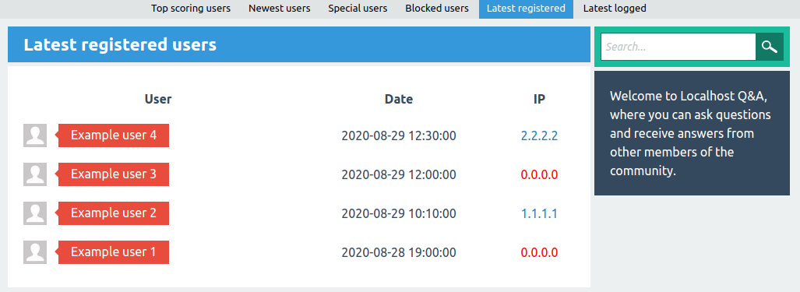
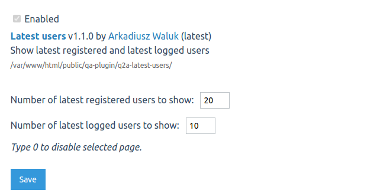

# Latest users plugin to [Question2Answer](http://question2answer.org/)

Plugin add pages with the latest registered and latest logged users with IP addresses. In addition, plugin highlights duplicated IP addresses, so you can simply detect multi-accounts.

Tested on **Q2A version >= 1.7.0 and PHP >= 7.0**. Code style adjusted to Q2A style.

## Installation

Clone or download this repository to *qa-plugin* directory in your Q2A.
 
## Configuration

Please go to admin panel and `Plugins` tab (*/admin/plugins*). Next, search *Latest users* and click *settings* link next to plugin description. At the end set number of latest registered and logged users per page, and click save.

If you want disable page, please set number to 0.

After you enable pages, links will be shown in `Users` page in a submenu. URLs to these pages are:
- */users/latest-registered*
- */users/latest-logged*

## Screenshots

